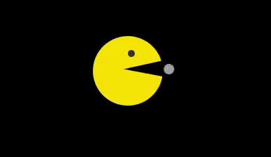

<h1 align="center">Projeto: Joguinho do PacMan ​🕹️​👾​🎮​</h1> 
 

## Descrição:dart::mag_right:

>Utilizando HTML e CSS recriei uma animação do famoso joguinho PacMan.
 

  

## Objetivo(s)👨‍💻💬👩‍💻

✔️ Compreender posicionamento de elementos;

✔️ Compreender transição de elementos;

✔️ Ganhar habilidades com animações/elementos responsivos;

✔️ Ganhar habilidades com divs;

✔️ Demostrar capacidade de recriação de tutorial.

 

## Referência(s):link:

<a href="https://www.youtube.com/watch?v=ZrQEZkD2ouw&t=12s" target="_blank">PAC-MAN In HTML & CSS | PAC-MAN Game Character Animation | HTML Tutorial | Going-To Internet</a>

